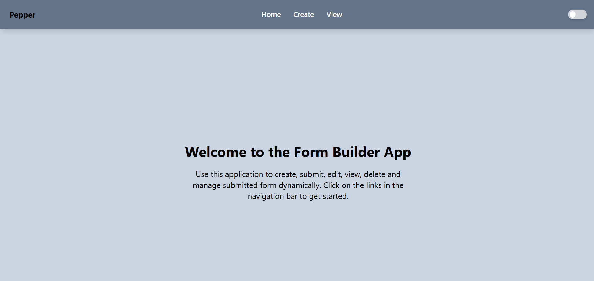

# Form Builder Application

A dynamic and interactive form builder application that allows users to create, edit, view, and manage forms. Users can customize forms with various input types such as email, text, password, number, and date. The application also supports drag-and-drop functionality for rearranging form fields and allows form responses to be submitted.

---


## Features

- **Home Screen:** Displays a list of all created forms with their titles.
- **Create Form:** 
  - Users can create new forms by adding various input types (Email, Text, Password, Number, Date).
  - Users can customize each input's title and placeholder.
  - Forms display inputs in a 2-column layout.
  - Drag-and-drop functionality allows users to rearrange input fields while creating the form.
  - Forms are saved in the database upon creation.
- **Edit Form:** 
  - Users can edit previously created forms and modify input details or add/remove inputs.
  - Drag-and-drop functionality is available to rearrange form inputs while editing the form.
- **View Form:** 
  - Displays the form in a view-only mode with input fields.
  - Allows users to enter data with all type validations working (e.g., email validation).
  - Includes a submit button to submit the form.inputs.

## Technologies

- **Frontend:** React.js
- **Backend:** Express.js
- **Database:** MongoDB

## API Endpoints

### Home Routes (/)

- **GET /**: Displays all forms with their titles.
- **GET /form/create**: Navigates to the form creation page.
- **GET /form/id/edit**: Navigates to the edit page for the specific form.
- **GET /form/id**: Displays the specific form.

### Create Form Routes (/form/create)

- **POST /form/create**: Create a new form with various input types.
  - **Body Params:**
    - `title`: Title of the form.
    - `inputs`: Array of input objects, each containing:
      - `type`: Input type (email, text, password, number, date).
      - `label`: Title of the input field.
      - `placeholder`: Placeholder for the input field.

### Edit Form Routes (/form/id/edit)

- **PUT /form/id/edit**: Edit an existing form.
  - **Body Params:**
    - `title`: New title of the form (optional).
    - `inputs`: Updated array of inputs (optional).
    - `removeInputs`: Array of input ids to remove from the form.

### View Form Routes (/form/id)

- **GET /form/id**: View the specific form with all its inputs.
- **POST /form/id/submit**: Submit the form with data.
  - **Body Params:**
    - `responses`: Array of user responses corresponding to each input.

### Additional Routes

- **GET /form**: Get all forms.
- **DELETE /form/id**: Delete a specific form by ID.

## Installation

### Prerequisites

- Node.js (v14+)
- MongoDB (Atlas or Local)

### Clone the Repository

```bash
git clone <repository-link>
cd form-builder-app
